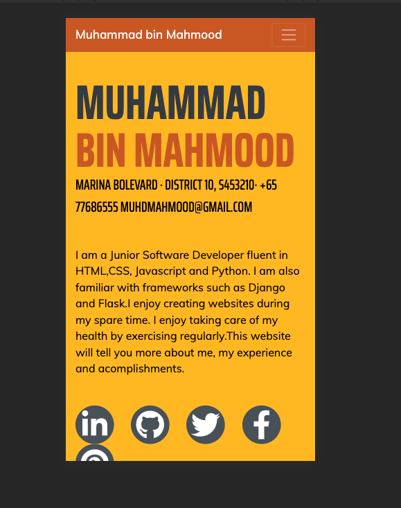

# Project-1-About-Muhammad
We were presented with a task to reflect what we have learned on HTML and CSS.
I took the opportunity to create an on-line resume that will showcase my current and new skills to my potential employers. 
I decided to built an online-resume because It is something that I feel that I can build on after the course and further demonstrate my technical abilities as a programmer.
I decided to go for a simple, fresh and easy to navigate webpage so that the user can easily find out facts about myself, my work experience
and favourite websites. I chose a blue theme because blue is my favourite color.
Working on this website allows me to improve my knowledge on using HTML and CSS code aided with bootstrap.
Specifically this project allows me to deepend my knowledge on
1) Using boostrap to make responsive websites with the help of 'container'
2) Using bootstrap to make navigation links with hanburger toggler button when screen resizes
3) Attaching images
4) Utilizing cards and diff css properties to make sticky notes effect
5) Positioning of text and images
6) Adjusting CSS styles to suit my website's design
7) RUnning code through validators encourages me to apply correct syntax
8) Applying padding and margin to text and images

# demo link

Click <a href="https://muhammad-mo.github.io/Muhammad-portfolio/" target="blank">Here</a> to see a demo of the website.

# Programming languages Used

1. HTML
2. CSS
3. Bootstrap 
4. Javascript

# Inital Design with Wireframe

The overall website's was planned with one page with several sections hilighting important aspects about me.

# Layout

The final product of the different webpages came out as intended displaying one page with different sections.
I utilised the <section> tags to achieve a single page with different sections.

The website has a total of 7 sections. Each section can be navigated with the use of the side bar.

1. About
2. Favourite Quotes
3. Experience
4. Education
5. Skills
6. Favourite Coding Resources
7. Favourite Coding Challenges

# Features & Testing
** Navigation Bar **

Each menu item of the navbar will magnify when clicked.

** Responsiveness **

The screen responds well to various mobile devices.

A hamburger type menu button drops down when pressed, revealing the different menu itmes allowing the users to navigate to different sections.

** Additional Features **

I utilised a simple bototsrap card feature to display my favoutite coding website.

A sticky note feature is implemenetd to hilight my achievements.

To further showcamse my understanding of HTML and CSS, I implemented a carousel from Bootstrap and modified the width and height of the carousel cards and images so that it will appear as how I wanted them to appear.

** Code Validator **
The code was put through th Jigsaw and W3 markup validator and the results are in the screenshot below

** Social Media **
Clicking on the social media icons brings the user to my social media page which was displayed in in another tab/window.
I achieved this by setting the "target" = blank  within the  link.

<a class="social-icon" href="https://github.com/Muhammad-MO" target="blank"><i class="fab fa-github"></a>

# Features left to implement

Future coding projetcs can be uploaaded for potential employers to  access my coding skills.

# Deployment

My site was deployed using Github's paltform.<a href="https://muhammad-mo.github.io/Muhammad-portfolio/" target="blank">Click here</a> to see the webpage

# Content

All content was authored by me.

# Media

Pictures for the carousel were taken from the respective websites.
1) https://theultralinx.com/ 
2) https://www.realsimple.com/

# Credit

References and bootstrap codes were used from the following websites

1. https://www.stackoverflow.com
2. https://www.w3schools.com
3. https://www.w3.org/
4. https://getbootstrap.com/
5. https://startbootstrap.com/themes

